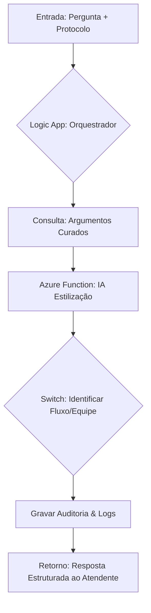
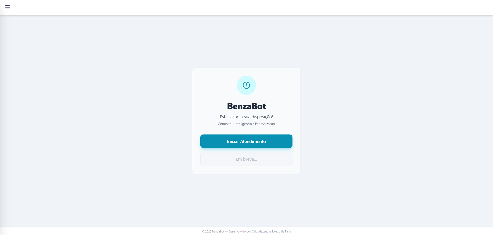
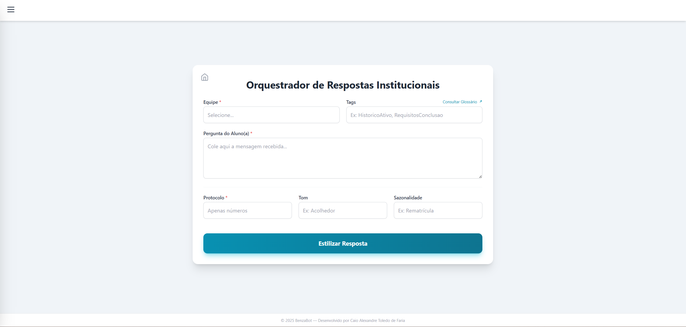
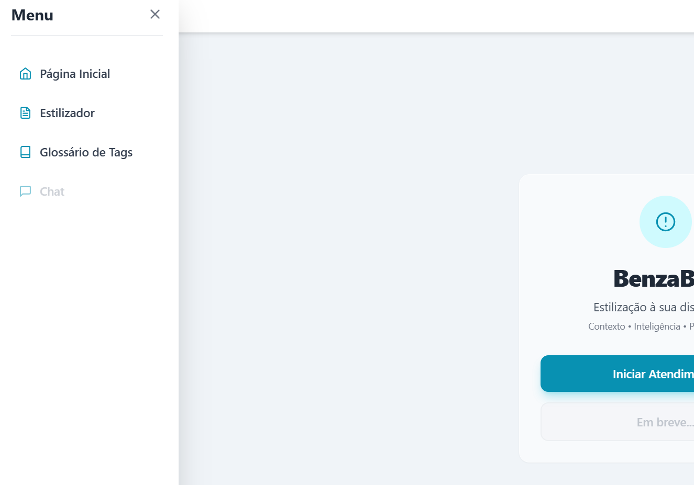
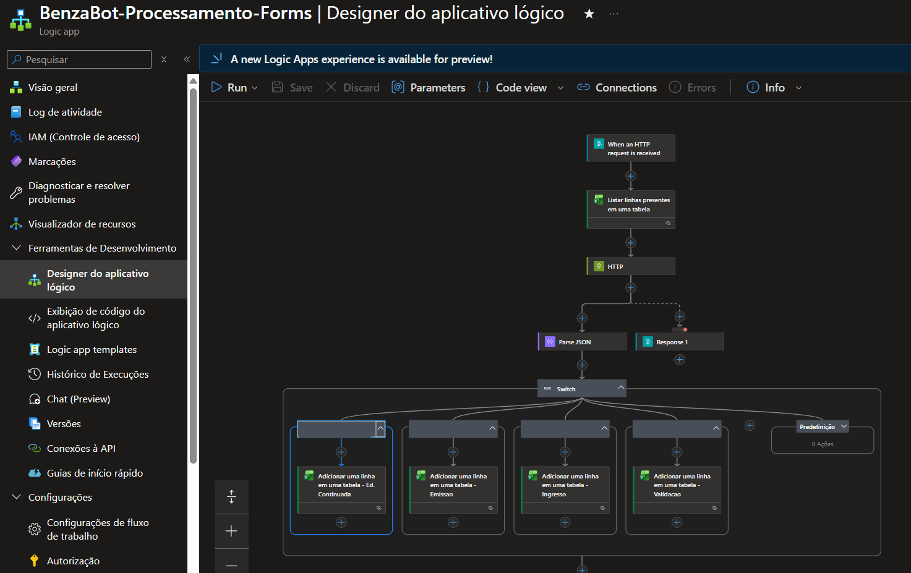
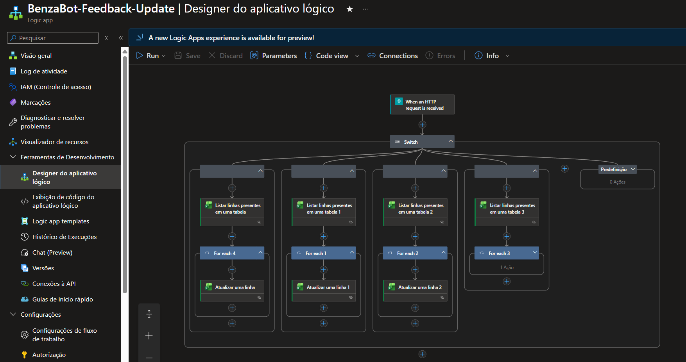

# BenzaBot: Orquestrador de Respostas Institucionais (ORI)

O **BenzaBot** (homenagem à Benzaiten, entidade japonesa que representa tudo que flui) é uma solução de **Arquitetura Serverless** desenvolvida para aprimorar e transformar atendimentos eletrônicos em ecossistemas acadêmicos e corporativos. Ele atua como uma ponte estratégica entre a **IA Generativa** e o rigor documental necessário em instituições de grande escala.

## Propósito & Valor de Negócio
Desenvolvido sob a ótica do **Lean Seis Sigma**, o BenzaBot foca na redução de variabilidade e eliminação de desperdícios operacionais:
* **Auditabilidade:** Registro integral de interações vinculado a protocolos para monitoria de qualidade.
* **Padronização:** Mitigação de "alucinações" de IA através de um **Argumentário Humano Curado** (Cache em nuvem).
* **Eficiência:** Redução drástica no tempo de resposta manual mantendo o tom de voz acolhedor, profissional e eficiente.
* **Escalabilidade:** Arquitetura dinâmica compatível com WhatsApp, E-mail e sistemas de ticket.

---

## Arquitetura Técnica (Azure Cloud)
O projeto utiliza uma orquestração de microsserviços para garantir alta disponibilidade e baixo custo:
1. **Gatilho (Request):** Frontend em HTML5/JS envia payloads JSON.
2. **Orquestração:** **Azure Logic Apps** gerencia o fluxo de trabalho e conectores de dados.
3. **Processamento de Dados:** Consulta a bases de conhecimento em **Excel Online/SharePoint**.
4. **Inteligência Artificial:** Integração com **Azure Functions (Python)** orquestrando modelos de linguagem para estilização contextualizada.
5. **Feedback Loop:** Sistema de avaliação que retroalimenta a base de auditoria para melhoria contínua.

### Fluxograma de Operação



---
## Demonstração Visual

### Interface do Usuário (UI)
| Home Page | Orquestrador (ORI) | Menu e Glossário |
| :---: | :---: | :---: |
|  |  |  |

### Arquitetura e Fluxos (Azure Cloud)
#### Processamento de Respostas (RAG)

*Fluxo agêntico integrando gatilhos HTTP, base de dados Excel e Azure Functions com IA.*

#### Ciclo de Feedback e Melhoria Contínua

*Mecanismo de captura de feedback para redução de variabilidade conforme métricas Lean Seis Sigma.*

## Orquestração de IA & Engenharia de Prompt
O BenzaBot opera como um sistema de **RAG (Retrieval-Augmented Generation)** resiliente, garantindo que a IA nunca invente regras institucionais.

### Estratégia de Grounding (Aterramento)
Para eliminar alucinações, o sistema utiliza uma busca em cascata no **Cache de Argumentos Curados**:
* **Match de Tags:** Prioridade máxima para tags específicas fornecidas pelo usuário.
* **Fallback por Palavra-Chave:** Varredura na pergunta do aluno em busca de termos técnicos.
* **Default de Equipe:** Caso nenhuma tag coincida, utiliza a diretriz padrão da célula (ex: `EDUCACAO_CONTINUADA`).

### Cascata de Modelos & Resiliência
O BenzaBot utiliza uma arquitetura de **Modelo em Cascata (Fallback)** para garantir alta disponibilidade e otimização de custos:

* **Processamento Dinâmico:** O backend está preparado para alternar entre diferentes LLMs (Large Language Models) caso o provedor principal atinja limites de taxa (Rate Limits).
* **Fail-Open Institucional:** Caso nenhum modelo de IA esteja disponível, o sistema fornece automaticamente a "Verdade Técnica" bruta do cache.
* **Prompt de Especialista:** As instruções de sistema são desacopladas do modelo, permitindo que a "Persona" do BenzaBot seja mantida independentemente do provedor de IA utilizado.

### As "Regras de Ouro"
A estilização é governada por uma *System Instruction* rigorosa:
* **Fidelidade Única:** A "Verdade Técnica" do cache é a única fonte permitida.
* **Rigor Formal:** Proibição de cortes em instruções de navegação e passos técnicos.
* **Tom Customizável:** Adaptação dinâmica baseada nos campos `Tom` e `Sazonalidade`.
* **Identidade Visual:** Respostas iniciadas obrigatoriamente com o identificador `🤖: `.

### Ciclo de Melhoria Contínua (Lean Six Sigma)
A interface inclui um sistema de feedback vinculado a um **Hash SHA-256** da resposta, permitindo rastrear notas baixas, identificar gaps no argumentário humano e monitorar a variabilidade da saída da IA conforme os padrões de qualidade da Secretaria.

---

## Como Citar este Projeto

Se este trabalho ou o **BenzaBot** foi útil para sua pesquisa ou automação, por favor, cite-o utilizando os formatos abaixo:

### Formato Padrão (Markdown)
**de Faria, Caio Alexandre Toledo.** *Soluções de Eficiência Acadêmica: Arquitetura Serverless e IA para Processos Educacionais*. Disponível em: [https://github.com/catdfaria/solucoes-eficiencia-academica](https://github.com/catdfaria/solucoes-eficiencia-academica) (2026).

### Formato Acadêmico (BibTeX)
```bibtex
@software{defaria_solucoes_2026,
  author = {de Faria, Caio Alexandre Toledo},
  title = {Soluções de Eficiência Acadêmica: Arquitetura e Automação com IA e Lean Six Sigma},
  url = {[https://github.com/catdfaria/solucoes-eficiencia-academica](https://github.com/catdfaria/solucoes-eficiencia-academica)},
  year = {2026},
  publisher = {GitHub}
}
